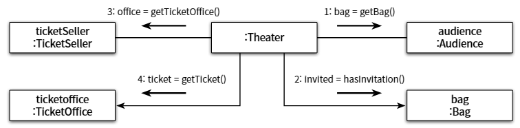

# 03. 설계 개선하기

- 변경과 의사소통의 문제가 엮여 있다
    - Theater가 관람객의 가방과 판매원의 매표소에 직접 접근하기 때문이다.
    - 그리고 이것은 관람객과 판매원이 자신의 일을 스스로 처리해야 한다는 직관을 벗어난다.
- Theater가 관람객의 가방과 판매원의 매표소에 직접 접근한다는 것은 Theater가 Audience와 TicketSeller에 함께 변경해야 한다는 의미이다.
- 해결 방법은 Theater가 Audience와 TicketSeller에 관해 너무 세세한 부분까지 알지 못하도록 하면 된다.
    - Theater가 관람객이 가방을 가지고 있다는 사실을 알아야 할까?
    - 판매원이 매표소에서 티켓을 판매한다는 사실을 알아야 할까?
    - Theater가 원하는 것은  관람객이 소극장에 입장하는 것 뿐이다.

⇒ 관람객과 판매원을 자율적인 존재로 만들면 되는 것!

### 자율성을 높이자

- TicketOffice에 접근하는 모든 코드를 TicketSeller 내부로 숨기기
    
    ```java
    public class Theater {
    	private TicketSeller ticketSeller;
    	
    	public Theater(TickerSeller ticketSeller) {
    		this.ticketSeller = ticketSeller;
    	}
    	
    	public void enter(Audience audience) {
    		ticketSeller.sellTo(audience);
    	}
    }
    ```
    
    ```java
    public class TicketSeller {
    	private	TicketOffice ticketoffice;
    	
    	public TicketSeller(TicketOffice ticketOffice) {
    		this.ticketOffice = ticketOffice;
    	}
    	
    	public void sellTo(Audience audience) {
    		if(audience.getBag().hasInvitation()) {
    			Ticket ticket = ticketSeller.getTicketOffice().getTicket();
    			audience.getBag().setTicket(ticket);
    		} else {
    			Ticket ticket = ticketSeller.getTicketOffice().getTicket();
    			audience.getBag().minusAmount(ticket.getFee());
    			ticketOffice().plusAmount(ticket.getFee());
    			audience.getBag().setTicket(ticket);
    		}
    	}
    }
    ```
    
    - ticketOffice가 private이고 public 메서드로 접근할 수 없으니 ticketOffice에 대한 접근은 오직 TicketSeller 안에만 존재한다.
    - 이처럼 개념적이나 물리적으로 객체 내부의 세부 사항을 감추는 것을 캡슐화라고 부른다.
- Audience의 Bag에 접근하는 모든 코드를 Audience 내부로 숨기기
    
    ```java
    public class TicketSeller {
    	private	TicketOffice ticketoffice;
    	
    	public TicketSeller(TicketOffice ticketOffice) {
    		this.ticketOffice = ticketOffice;
    	}
    	
    	public void sellTo(Audience audience) {
    		ticketOffice.plusAmount(audience.buy(ticketOffice.getTicket()));
    	}
    }
    ```
    
    ```java
    public class Audience {
    	private Bag bag;
    	
    	public Audience(Bag bag) {
    		this.bag = bag;
    	}
    	
    	public Long buy(Ticket ticket) {
    		if(bag.hasInvitation()) {
    			bag.setTicket(ticket);
    			return 0L;
    		} else {
    			bag.setTicket(ticket);
    			bag.minusAmount(ticket.getFee());
    			return ticket.getFee();
    		}
    	}
    }
    ```
    
- 캡슐화는 변경하기 쉬운 객체를 만드는 것이다.
    - 캡슐화를 통해 객체 내부로의 접근을 제한하면 객체와 객체 사이의 결합도를 낮출 수 있기 때문에 설계를 좀 더 쉽게 변경할 수 있게 된다.

### 무엇이 개선됐는가

- Audience와 TicketSeller는 능동적으로 행동한다, 그리고 그것은 우리의 예상과 정확하게 일치한다.
- Audience와 TicketSeller의 내부 구현을 변경하더라도 Theater를 함께 변경할 필요가 없다.
- 즉, 변경 용이성과 의사소통 관점에서 개선되었다.

### 어떻게 한 것인가

- 판매자가 티켓을 판매하기 위해 TicketOffice를 사용하는 모든 부분을 TicketSeller 내부로 옮겼다.
- 관람객이 티켓을 구매하기 위해 Bag를 사용하는 모든 부분을 Audience 내부로 옮겼다.

 ⇒ 자신의 문제를 스스로 해결하도록 코드를 변경한 것이다.

### 캡슐화와 응집도

- 응집도가 높다 ⇒ 밀접하게 연관된 작업만을 수행하고 연관성 없는 작업은 다른 객체에게 위임하는 객체
- 응집도를 높이기 위해서는 객체 스스로 자신의 데이터를 책임져야 한다. ⇒ 객체의 캡슐화가 잘 되어야 한다.

 ⇒  외부의 간섭을 최대한 배제하고 메시지를 통해서만 협력하는 자율적인 객체들의 공동체를 만들어야 한다.

### 절차지향과 객체지향

- Theater에게 enter 메서드는 Process 이다.
- Theater에게 Audience, TicketSeller, Bag, TicketOffice는 Data 이다.

 ⇒ 위처럼 prcess와 data를 별도의 모듈에 위치시키는 방식은 절차적 프로그래밍이다.

- 절차적 프로그래밍은 직관에 위배되며, 수동적인 흐름이 존재한다.
- 데이터의 변경으로 인한 영향을 지역적으로 고립시키기 어렵기 때문에 변경하기 어려운 코드를 양산한다.

- 변경하기 쉬운 설계는 한 번에 하나의 클래스만 변경할 수 있는 설계다.
- 자신의 data를 스스로 처리하도록 process의 적절한 단계를 이동시켜야 한다.

 ⇒ 위처럼 process와 data가 동일한 모듈 내부에 위치하도록 프로그래밍 하는 방식은 객체지향 프로그래밍이다.

- 훌륭한 객체지향 설계의 핵심

 ⇒ 캡슐화를 이용해 의존성을 적절히 관리하여 객체 간의 결합도를 낮춘다.

> 자신의 데이터를 스스로 처리하는 것. 
데이터와 프로세스가 동일한 모듈 내부에 위치하도록 하는 것.
> 

### 책임의 이동

- 절차 지향은 책임이 Theater에 집중되어 있다.
    
    
    
- 그러나 객체지향 설계에서는 그 책임이 여러 객체에 집중되어 있다. (책임의 이동)
    
    
    
    - 각 객체는 자신을 스스로 책임진다.
    - 스스로 책임을 수행하는 자율적인 객체들의 공동체를 구성하여 완성된다.
- 객체지향 설계의 핵심은 적절한 객체에 적절한 책임을 할당하는 것이다.
- 이는 이해하기 쉽고 변경하기 쉬운 코드를 만들어준다.

- 설계를 어렵게 만드는 것은 의존성이다.
- 해결 방법은 불필요한 의존성을 제거하여 객체 사이의 결합도를 낮추는 것이다.
- 그리고 캡슐화는 객체의 결합도를 낮추고 응집도를 높이는 방법이다.

### 더 개선할 수 있다

- Bag을 자율적인 존재로 바꿀 수 있다.
    
    ```java
    public class Audience {
    	private Bag bag;
    	
    	public Audience(Bag bag) {
    		this.bag = bag;
    	}
    	
    	public Long buy(Ticket ticket) {
    		return bag.hold(ticket);
    	}
    }
    ```
    
    ```java
    public class Bag {
    	private Long amount;
    	private Invitation invitation;
    	private Ticket ticket;
    	
    	public Long hold(Ticket ticket) {
    		if(bag.hasInvitation()) {
    			setTicket(ticket);
    			return 0L;
    		} else {
    			setTicket(ticket);
    			minusAmount(ticket.getFee());
    			return ticket.getFee();
    		}
    	}
    	
    	public boolean hasInvitation() {
    		return invitation != null;
    	}
    	
    	public void setTicket(Ticket ticket) {
    		this.ticket = ticket;
    	}
    	
    	public void minusAmount(Long amount) {
    		this.amount -= amount;
    	}
    }
    ```
    
- TicketOffice 자율적인 존재로 바꿀 수 있다.
    
    ```java
    public class TicketSeller {
    	private	TicketOffice ticketoffice;
    	
    	public TicketSeller(TicketOffice ticketOffice) {
    		this.ticketOffice = ticketOffice;
    	}
    	
    	public void sellTo(Audience audience) {
    		ticketOffice.sellTicketTo(audience);
    	}
    }
    ```
    
    ```java
    public class TicketOffice {
    	// 판매할 티켓
    	private List<Ticket> tickets = new ArrayList<>();
    	// 판매 금액
    	private Long amount;
    	
    	// 매표소 생성자
    	public TicketOffice(Long amount, Ticket ... tickets) {
    		this.amount = amount;
    		this.tickets.addAll(Arrays.asList(tickets));
    	}
    	
    	// 자율적인 메서드 추가
    	public void sellTicketTo(Audience audience) {
    		plusAmount(audience.buy(getTicket()));
    	}
    	
    	// 티켓 판매
    	public Ticket getTicket() {
    		return tickets.remove(0);
    	}
    	// 판매 금액 계산
    	public void plusAmount(Long amount) {
    		this.amount += amount;
    	}
    	public void minusAmount(Long amount) {
    		this.amount -= amount;
    	}
    }
    ```
    

- 하지만 이러한 변경은 문제가 하나 있다.

 ⇒ TicketOffice와 Audience 사이에 의존성이 추가되었다.

- 설계에 대한 2가지 사실을 알 수 있다.
    1. 어떤 기능을 설계하는 방법은 한 가지 이상일 수 있다.
    2. 동일한 기능을 한 가지 이상의 방법으로 설계할 수 있기 때문에 설계는 trade-off의 산물이다.

> 설계는 균형의 예술이다.
> 

### 그래, 거짓말이다!

- 사실 현실에서 수동적인 존재지만 객체지향의 세계에서는 능동적이고 자율적인 존재가 된다.
- 레베카 워프스브록은 능동적이고 자율적인 소프트웨어 객체를 설계하는 것을 의인화라고 부른다.

 ⇒ 한 편의 애니메이션을 만든다고 생각하고 객체들을 자율적으로 설계하자.