# 01장 - 디자인 패턴 소개와 전략 패턴 _ 디자인 패턴의 세계로 떠나기

## 오리 시뮬레이션 게임

---

### 기존 오리 객체

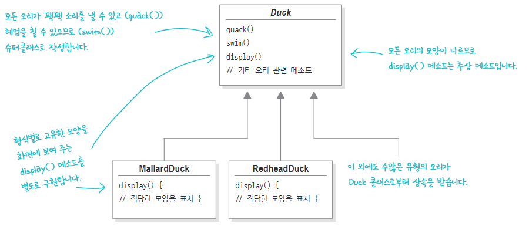

### fly() 라는 새로운 요구사항을 받아 수정한 오리 객체

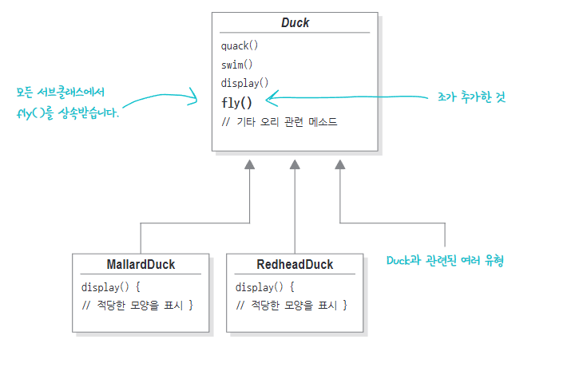

### 새로운 오리 객체의 문제점

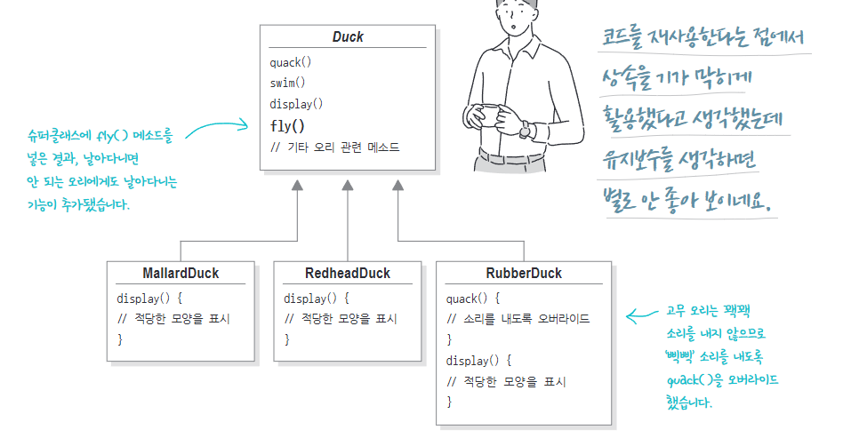

- Duck이라는 슈퍼클래스에 fly라는 메소드를 추가함으로써 일부 서브클래스에 문제가 생긴다.
    - 서브클래스인 RubberDuck에 fly()의 기능이 생긴다.
- 이는 상속에 의해 생긴 문제점
    - 특정 기능을 갖고 있지 않아도 해당 기능을 오버라이드 해야한다.

### 이를 해결하기 위한 인터페이스 설계

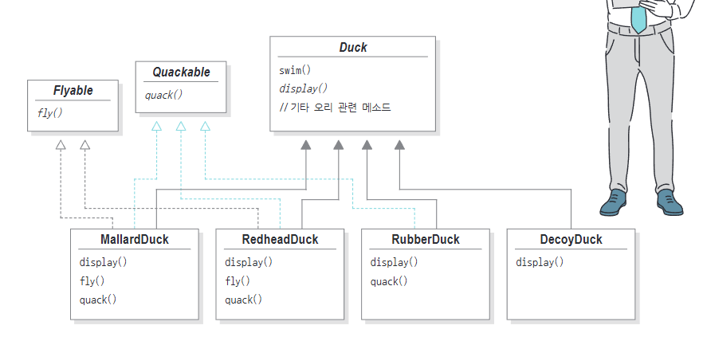

- 앞으로 내용이 바뀔 수 있는 것을 인터페이스화

 ⇒ 하지만 위의 방법도 fly라는 기능이 바뀐다면 모든 서브클래스의 fly를 직접 수정해야함

> 소프트웨어 개발 불변의 진리
> 
- 시간이 지남에 따라 변화하고 성장해야 한다.

### 문제를 명확하게 파악하기

1. 상속을 사용할 경우 서브클래스마다 같은 기능을 오버라이드 해야한다.
2. 인터페이스화 할 경우 코드를 재사용할 수 없다.

<aside>
💡

***첫번째 디자인 원칙*** 

</aside>

- 애플리케이션에서 달라지는 부분을 찾아내고, 달라지지 않는 부분과 분리한다.

 ⇒ 달라지는 부분을 찾아서 “캡슐화”하면 코드를 변경하는 과정에서 의도치 않게 발생하는 일을 줄이면서 시스템의 유연성을 향상시킬 수 있다.

### 바뀌는 부분과 그렇지 않은 부분 분리하기

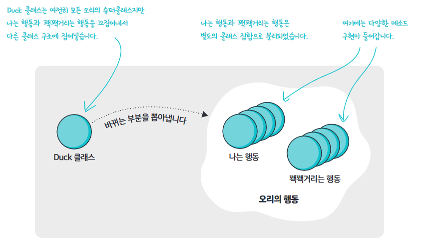

- Duck 클래스에서 나는 행동과 꽥꽥거리는 행동은 서브클래스에 따라서 달라진다.
- 따라서 변화가 있으므로 두 행동을 따로 분리한다.

### 오리의 행동을 디자인하는 방법

1. 나는 행동과 꽥꽥거리는 행동을 유연하게 만들어야한다.
2. Duck 인스턴스에 행동을 할당할 수 있어야 한다.
3. Duck 클래스에 행동과 관련된 Setter 메소드를 포함해야 한다.

<aside>
💡

***두번째 디자인 원칙***

</aside>

- 구현보다는 인터페이스에 맞춰 프로그래밍 한다.

⇒ “상위 형식에 맞춰서 프로그래밍하라”는 원칙을 지켜야 한다.

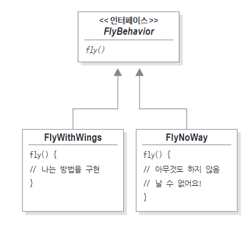

- 특정 행동을 인터페이스로 표현하고, 이를 사용하여 행동을 구현한다.
- 해당 디자인을 사용하면 구체적인 행동이 Duck 서브클래스에 국한되지 않는다.

### 오리의 행동을 구현하는 방법

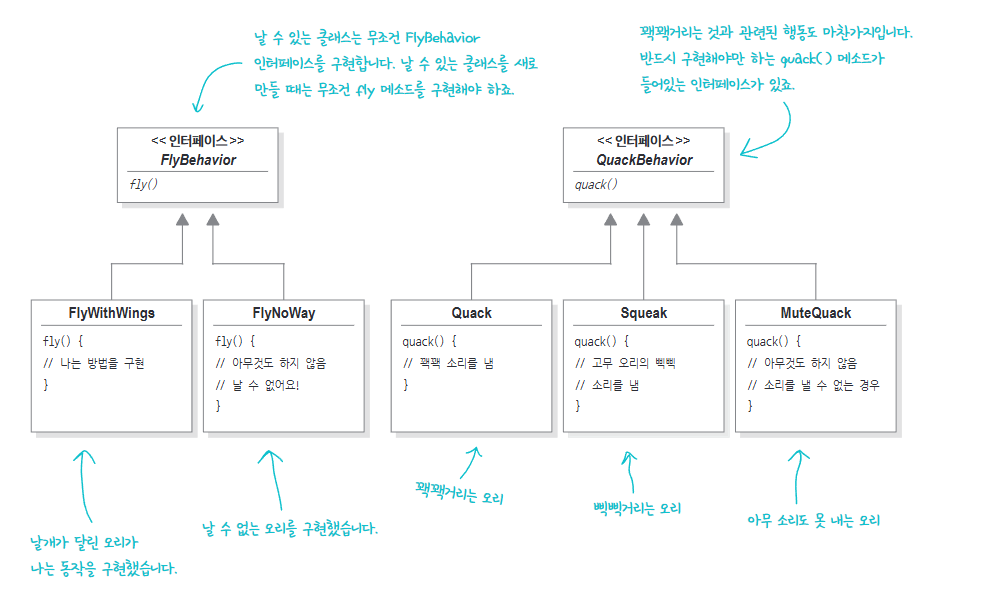

- 다른 형식의 객체에서도 나는 행동과 꽥꽥거리는 행동을 재사용할 수 있다.
- Duck 클래스를 전혀 건드리지 않고 새로운 행동을 추가할 수 있다.
    - Duck 클래스 안에 행동이 있지 않기 때문이다.

### 오리 행동 통합하기

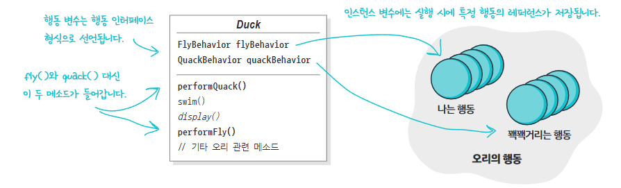

- Duck 클래스에 performFly(), performQuack()이라는 메소드를 넣는다.

### 오리 코드 테스트

- 코드로 확인

### 동적으로 행동 지정하기

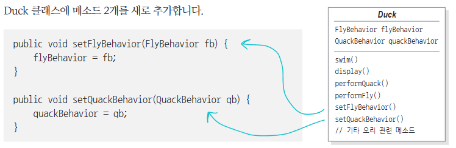

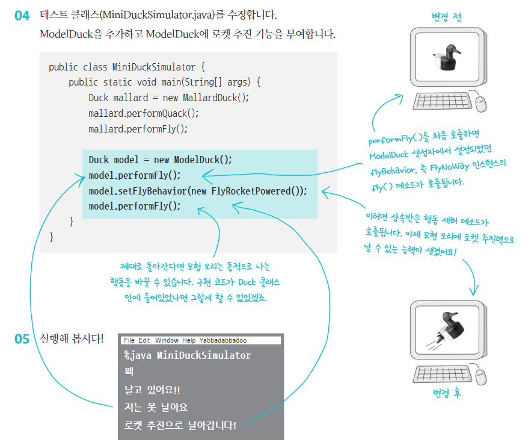

- 오리의 행동을 동적으로 할당하여 표현할 수 있다.

### 캡슐화된 행동 살펴보기

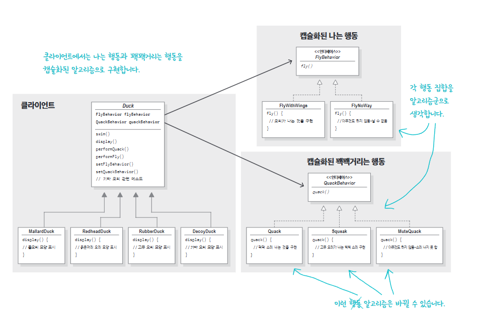

- 오리의 행동들을 일련의 알고리즘 알고리즘군으로 생각하자.

### 두 클래스를 합치는 방법

- “A에는 B가 있다” 관계를 생각해보자.
    - 각 오리에는 FlyBehavior와 QuacBehavior가 있고, 맞는 행동들을 위임받는다.
    - 각 오리는 행동을 상속 받지 않고 행동 객체로 구성되어 행동을 부여받는다.

 ⇒ 이를 “구성(composition)” 이라고 한다.

<aside>
💡

세번째 디자인 원칙

</aside>

- 상속보다는 구성을 활용한다.

## 첫번째 디자인 패턴: 전략 패턴

---

### 전략 패턴

- 알고리즘군을 정의하고 캡슐화해서 각각의 알고리즘군을 수정해서 쓸 수 있게 한다.
- 클라이언트로부터 알고리즘을 분리해서 독립적으로 변경할 수 있다.

## 디자인 패턴 만나기

---

### 패턴과 전문 용어

1. 서로 알고 있는 패턴은 정말 막강하다
    - 패턴으로 의사소통하면 패턴에 담겨있는 모든 내용, 특성, 제약조건등을 함께 이야기할 수 있다.
2. 패턴을 사용하면 간단한 단어로 많은 얘기를 할 수 있다.
    - 뭔가를 설명할 때 다른 개발자에게 빠르고 정확하게 전달해줄 수 있다.
3. 패턴 수준에서 이야기 하면 디자인에 더 오랫동안 집중할 수 있다.
    - 객체와 클래스를 구현하는 자질구레한 내용보다 디자인 수준에서 초점을 맞출 수 있다.
4. 전문 용어를 사용하면 개발팀의 능력을 극대화할 수 있다.
    - 오해의 소지가 줄어 작업을 빠르게 진행할 수 있다.
5. 전문 용어는 신입 개발자에게 훌륭한 자극제가 된다.

### 디자인 패턴 사용법

- 라이브러리와 프레임워크가 관리하기 쉽고 유연한 애플리케이션의 구조를 만드는데 도움을 주지 못한다.
- 이런 도움을 주는 것은 디자인 패턴이다.
- 여러 가지 패턴 → 개발자 → 디자인 패턴을 적용한 코드
- 관리가 용이한 객체지향 시스템을 만들기 위해서는…
    - “나중에 그 시스템이 어떻게 바뀔 것인지” 생각해보자

### 디자인 도구상자 안에 들어가야 할 도구들

1. 객체지향 기초(추상화, 캡슐화, 다형성, 상속 등..)
2. 객체지향 원칙 (바뀌는 부분은 캡슐화한다, 상속보다는 구성을 활용한다 등..)
3. 객체지향 패턴 (전략 패턴 등…)

### 핵심 정리

- 재사용성, 확장성, 관리의 용이성을 갖출 줄 알아야 한다.
- 패턴은 훌륭한 객체지향 디자인 품질을 갖추고 있는 시스템을 만드는 방법을 제공한다.
- 대부분의 패턴과 원칙은 소프트웨어의 변경 문제와 연관되어 있다.
- 시스템에서 바뀌는 부분을 골라내서 캡슐화해야 한다.
- 패턴은 다른 개발자와의 의사소통을 극대화하는 전문 용어 역할을 한다.